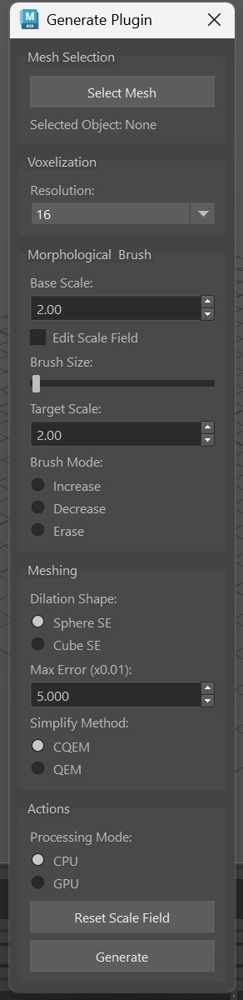

# VoMoBo: Mesh Simplification Plugin for Maya

## Construct a bounding proxy using Voxelization & Morphology & Bounding

Based on: [Bounding Proxies for Shape Approximation](https://perso.telecom-paristech.fr/boubek/papers/BoundingProxies/) by STEPHANE CALDERON and TAMY BOUBEKEUR (SIGGRAPH 2017)

CIS 660 Maya Plug-in

## Project Overview

This project is a Maya plugin that enables users to:

- Generate shape approximation models based on morphological closing.

- Perform high-resolution morphological modifications using GPU.

- Interactively edit the scale field using a brush tool to refine the approximation model.

The goal is to faithfully reproduce and demonstrate the algorithm described in the paper: [Bounding Proxies for Shape Approximation](https://perso.telecom-paristech.fr/boubek/papers/BoundingProxies/), and seamlessly integrate it with the Maya API.

## Pipeline

1. Mesh Selection - Select the target mesh M from the Maya scene.

2. Voxelization - Convert mesh M into a voxel grid G at the specified resolution. This step uses triangle-parallel solid voxelization, based on the method introduced in [Fast Parallel Surface and Solid Voxelization on GPUs](https://michael-schwarz.com/research/publ/files/vox-siga10.pdf) by Michael Schwarz and Hans-Peter Seidel.

3. Mipmaping - Build a pyramid $hat{G}$ from the binary voxel grid G, enabling efficient multi-resolution operations.

4. Spatially Varying Dilation - Perform parallel spatially varying dilation D using hierarchical collision detection. This process simulates collisions between $hat{G}$ and a field of structuring elements (SEs) to produce locally adaptive dilation.

5. Scale-augmented pyramid - Extract the 6-connected contour from D and build a scale-augmented pyramid $hat{D_c}$, encoding both geometry and local scale information.

6. Spatially Varying Erosion - Apply spatially varying erosion to complete the morphological closing operator, generating grid E which represents the final closed shape.

7. Cube Marching - Use the cube marching algorithm (from libigl) on voxel grid E to extract a coarse mesh proxy.

8. Edge Collapse - Perform edge collapse-based simplification by combining classical Quadric Error Metrics (QEM, via OpenMesh) with linear constraints. This ensures local bounding conditions and upper-bounded edge lengths relative to the local scale field.

## Features

- Mesh Selection
    - Easily select a mesh from the Maya scene for processing and simplification.
- Voxelization Control
    - Adjustable voxel resolution (from 8 to 2048) to control the detail level of voxelization.
- Morphological
    - Set a base scale value for morphological closing operations to define the proxy surface thickness.
- Interactive Scale Field Editing
    - Enable Edit Scale Field mode for manual refinement.
    - Adjustable Brush Size slider for localized control.
    - Set a Target Scale value that determines the brush’s target influence.
    - Three brush modes for intuitive editing:
        - Increase
        - Decrease
        - Erase
    - When Edit Scale Field is selected, users can click on the model in Maya scene to modify the scale field.
- Processing Mode
    - Option to choose between CPU and GPU computation modes based on system capabilities.
- Dilation Shape Selection
    - Support for two structuring element shapes:
        - Sphere SE
        - Cube SE
- Meshing Controls
    - Set Max Error (scaled by x0.01) for controlling mesh decimation precision during proxy generation.
- Actions
    - Reset Scale Field button to clear manual edits and return to default state.
    - Generate button to run the complete process and output the simplified mesh.

## Installation

## Usage

## Reference Paper

## External Libraries Used